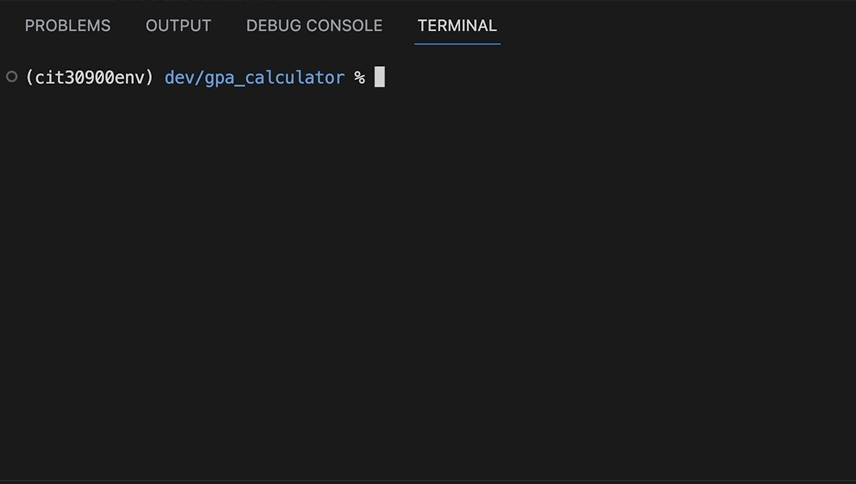

# GPA Calculator
Using Python, create a command line program that requests grades from the user and responds with all of the grades they have entered and a calculation of their grade point average (GPA).

## Starter Code
Starter code is provided to you in [`index.py`](index.py). This is a recommended structure for this application, but you may choose your own.

## Getting Started
1. Create a new directory named `gpa_calculator` *inside* your **local root folder** for this course.
2. Write your code in a file named `index.py` in the `gpa_calculator` directory.
3. You should be able to run your program by typing `python index.py` from the command line while you are in your `gpa_calculator` directory.

## Instructions
1. Your program should request a grade from the user.
    * If the grade is invalid, repeat your request to the user.
2. Append the grade and its numerically equivalent value to two lists defined in your program.
3. Calculate the GPA based on all of the grades that have been input in this session of the program.
4. Print two lines of response to the user:
    * `Your grades are: ______` (include the grades that have been input)
    * `Your GPA is ______` (include the calculated GPA with no rounding)
5. Ask if the user would like to (C) continue or (X) exit
   * If they want to continue, start back at step #1
   * If they want to exit, terminate the program
   * If they respond with unexpected input, repeatedly ask if they would like to continue or exit

## Hints
* **Remember the importance of variable scope.** Your program should not include any "global" variables. Any information needed by a function should be passed into that function.

## Submission Instructions
To submit, simply attach your `index.py` file to the Assignments tool in Canvas.

## Example
An animated .gif file with a working solution appears below.

